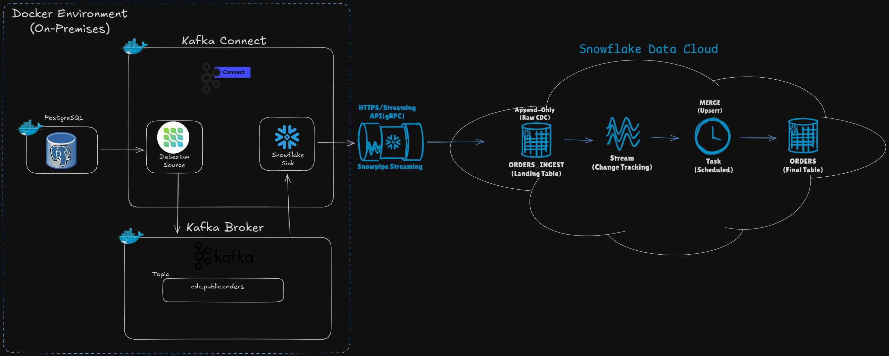

# 🚀 Real-Time CDC Pipeline: PostgreSQL to Snowflake

Este projeto implementa um pipeline de dados **Change Data Capture (CDC)** de alta performance. O objetivo é replicar transações de um banco operacional (OLTP) para um Data Warehouse (OLAP) com latência de segundos, utilizando **Snowpipe Streaming** e uma arquitetura robusta de ingestão e consolidação.

## Tecnologias Utilizadas

<div align="center">

<table>
  <tr>
    <td align="center">
      <a href="https://www.docker.com/" target="_blank">
        
      </a>
    </td>
    <td align="center">
      <a href="https://www.postgresql.org/" target="_blank">
        
      </a>
    </td>
    <td align="center">
      <a href="https://kafka.apache.org/" target="_blank">
        
      </a>
    </td>
    <td align="center">
      <a href="https://www.snowflake.com/pt_br/" target="_blank">
        
      </a>
    </td>
  </tr>
</table>

</div>


## 🏛️ Arquitetura

O fluxo de dados segue a arquitetura abaixo:

1.  **Origem (PostgreSQL):** As transações ocorrem no banco `northwind`.
2.  **Captura (Debezium):** O conector lê o *Write-Ahead Log (WAL)* do Postgres.
3.  **Transporte (Kafka):** Os dados são serializados em JSON e enviados para tópicos no Kafka Broker.
4.  **Ingestão (Snowpipe Streaming):** O conector Snowflake Sink lê do Kafka e faz a ingestão via gRPC diretamente para tabelas no Snowflake.
5.  **Transformação (Snowflake Tasks):** Uma *Task* agendada faz o `MERGE` (Deduplicação, Updates e Deletes) da tabela de ingestão (Raw) para a tabela final (Bronze).



## ⚖️ Decisão de Arquitetura (ADR)

Para a camada de transformação no Snowflake (CDC Merge), existem duas abordagens modernas. Este projeto adota intencionalmente a abordagem **Imperativa (Stream + Task)**.

### 🔹 Escolha Atual: Stream + Task (Imperativo)
Optou-se por controlar manualmente o ciclo de vida dos dados.
* **Controle Total:** Permite implementar lógicas complexas de `MERGE` (ex: tratamento de *Deletes* lógicos via SMT rewrite).
* **Aprendizado:** Excelente para entender a mecânica de deduplicação e ordenação de eventos em sistemas distribuídos.
* **Custo & Performance:** Eficiência ajustada pelo agendamento da Task (CRON) e tamanho do Warehouse, evitando processamento desnecessário.

### 🔸 Alternativa: Dynamic Tables (Declarativo)
Reconhecemos que *Dynamic Tables* são uma alternativa viável.
* **Abordagem:** Define-se apenas o `SELECT` final e o `TARGET_LAG`. O Snowflake gerencia a orquestração.
* **Trade-off:** Ganha-se facilidade de manutenção ("Set and Forget"), mas perde-se a granularidade de controle sobre como cada linha é processada e tratada em cenários de borda.

---

## 📂 Estrutura do Projeto

```bash
├── Postgres/               # Ambiente do Banco de Origem
│   ├── docker-compose.yml  # Postgres + pgAdmin
│   └── initdb/             # Scripts de DDL e DML (Northwind)
│
├── kafka/                  # Core de Streaming
│   ├── docker-compose.yml  # Zookeeper, Broker, Schema Registry, Connect, AKHQ
│   └── connectors-config/  # JSONs de configuração dos conectores
│
├── Snowflake/              # Scripts e Configurações do Destino
│   └── setup_pipeline.md  # SQL para criar DB, Schema, Tables, Streams e Tasks
│
├── setup_connectors.sh     # Script para automatizar o deploy dos conectores
└── README.md               # Documentação do Projeto
```
##
### 🛠️ Pré-requisitos
- Docker e Docker Compose instalados.

- [Conta no Snowflake](https://signup.snowflake.com/?trial=student) (Trial ou Enterprise).

- Chaves RSA geradas para autenticação segura no Snowflake.

##

### Como Executar
### 1. Preparar o Ambiente Snowflake
Execute o script SQL localizado em Snowflake/setup_pipeline.md na sua conta Snowflake para criar:

    - Usuário de serviço (SNFLK_USER_KAFKA) e Roles.

    - Databases (RAW_KAFKA, BRONZE).

    - Tabelas (ORDERS_INGEST, ORDERS).

    - Importante: Configure a Chave Pública RSA no usuário criado.

### 2. Iniciar o Banco de Dados (Origem)
Suba o banco de dados e popule com os dados iniciais:

```bash
cd Postgres
docker-compose up -d
```
Validação: Acesse o pgAdmin em http://localhost:5050.

### 3. Iniciar o Cluster Kafka
Suba os serviços de mensageria e o Kafka Connect:

```bash
cd ../kafka
docker-compose up -d
```
Validação: Acesse o AKHQ (Kafka UI) em http://localhost:8080 para monitorar os tópicos e conectores.

### 4. Deploy dos Conectores (Automação)
Para configurar os conectores automaticamente, utilize o script ```setup_connectors.sh``` na raiz do projeto.

```bash
chmod +x setup_connectors.sh
./setup_connectors.sh
```
##
### ⚙️ Detalhes de Configuração
#### Source Connector (Debezium PostgreSQL)
    - Plugin: pgoutput (decodificação lógica nativa do Postgres 10+).

    - Snapshot Mode: initial (realiza carga histórica inicial e depois muda para streaming).

    - Topic Prefix: cdc (ex: cdc.public.orders).

    - Tombstones: Desativados (tombstones.on.delete=false), pois o tratamento de delete é feito no Sink via SMT.

#### Sink Connector (Snowflake Streaming)
    - Ingestion Method: SNOWPIPE_STREAMING (Alta performance e baixa latência via gRPC).

    - Buffer Flush: 1 segundo (Configurado para Near Real-Time).

    - SMT (Single Message Transform): Utiliza ExtractNewRecordState para "aplanar" a estrutura complexa do Debezium e extrair metadados essenciais (__op, __source_ts_ms) para o controle de versão no Snowflake.
##

🛡️ Segurança
Este projeto utiliza Key Pair Authentication (RSA 2048) para comunicação entre o Kafka Connect e o Snowflake.

Nunca commite o arquivo da chave privada (rsa_key.p8) no Git.

Utilize o .gitignore para excluir arquivos de chaves e configurações sensíveis.

Em produção, recomenda-se o uso de Secrets Management ou variáveis de ambiente para injetar a chave privada (SNOWFLAKE_PRIVATE_KEY) no container.